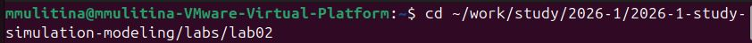
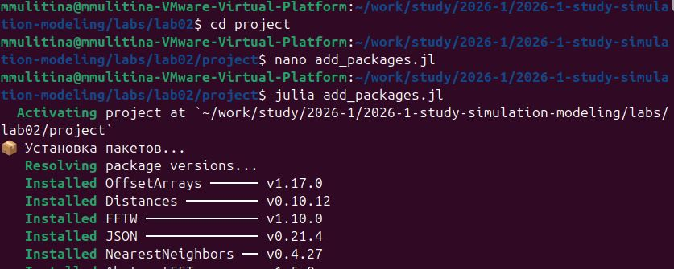
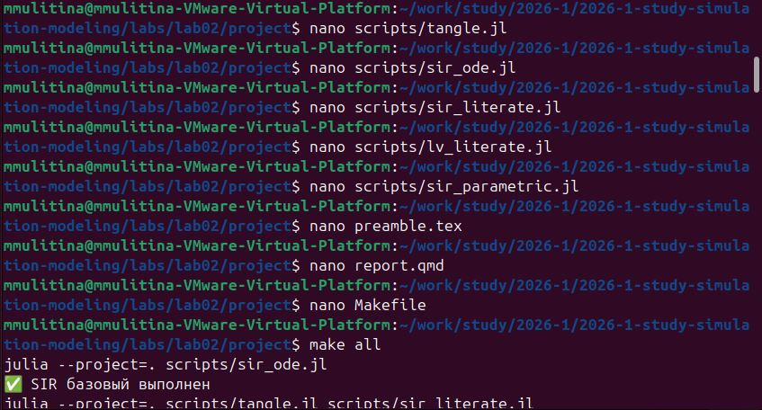

---
author:
  name: Улитина Мария Максимовна
  email: 1132236002@rudn.ru
  affiliation:
    - name: Российский университет дружбы народов
      country: Российская Федерация
      postal-code: 117198
      city: Москва
      address: ул. Миклухо-Маклая, д. 6
title: "Лабораторная работа №2: Модели SIR и Лотки-Вольтерры"
subtitle: Пошаговое руководство
license: CC BY
date: today
date-format: "YYYY-MM-DD"
format:
  beamer:
    slide_level: 2
    aspectratio: 169
    section-titles: true
    theme: metropolis
  revealjs:
    theme: beige
---

# Информация

## Докладчик

:::::::::::::: {.columns align=center}
::: {.column width="70%"}

  * Улитина Мария Максимовна
  * студентка
  * Российский университет дружбы народов им. П. Лумумбы
  * [1132236002@rudn.ru](mailto:1132236002@rudn.ru)

:::
::: {.column width="30%"}


:::
::::::::::::::

# Вводная часть

## Актуальность

- Лабораторная работа №2 посвящена численному моделированию
- Изучаются классические математические модели
- Модель SIR — эпидемиологическая динамика
- Модель Лотки-Вольтерры — динамика популяций «хищник–жертва»

## Объект и предмет исследования

- Системы обыкновенных дифференциальных уравнений
- Инструменты: Julia, DrWatson, Literate, Quarto
- Численные методы решения ОДУ

## Цели и задачи

- Создать проект DrWatson с воспроизводимой структурой
- Реализовать модели SIR и Лотки-Вольтерры на Julia
- Провести параметрический анализ модели SIR
- Оформить отчёт в Quarto и зафиксировать результаты в Git

## Материалы и методы

- Julia — язык программирования для научных вычислений
- DrWatson — фреймворк воспроизводимых проектов
- DifferentialEquations.jl — численное решение ОДУ
- Literate.jl — литературное программирование
- Quarto — генерация отчётов в PDF/HTML

# Выполнение работы

## Шаг 1: Подготовка рабочего окружения

Создаём каталог на основе шаблона и переходим в него:

```bash
cd ~/work/study/2026-1/2026-1--study--simulation-modeling/labs/lab02
```

<!-- Вставьте скриншот терминала с переходом в каталог: -->
{#fig-001 width=70%}

## Шаг 2: Создание проекта DrWatson

Инициализируем проект:

```julia
julia -e 'using Pkg; Pkg.add("DrWatson"); using DrWatson;
    initialize_project("project"; authors="Улитина Мария Максимовна", git=false)'
cd project
```

{#fig-002 width=70%}

## Шаг 3: Установка пакетов

Создаём файл `add_packages.jl` и запускаем установку:

```julia
packages = ["DrWatson", "DifferentialEquations", "Plots", "DataFrames",
    "CSV", "JLD2", "Literate", "IJulia", "BenchmarkTools",
    "Quarto", "StatsPlots", "LaTeXStrings", "FFTW"]
Pkg.add(packages)
```

```bash
julia add_packages.jl
```

{#fig-003 width=70%}

## Шаг 4: Создадим необходимые скрипты

Создаем необходимые файлы в соответствии с заданием:

{#fig-004 width=70%}

## Шаг 5: Отправим изменения в git

Когда все скрипты успешно отработают, отправим изменения в git

{#fig-005 width=70%}


##  Выводы

- Проект полностью воспроизводим командой `make all`
- Реализованы модели SIR и Лотки-Вольтерры на Julia в соответствии с заданием
- Проведён параметрический анализ влияния $\beta$ на динамику эпидемии
- Отчёт оформлен в Quarto PDF с поддержкой русского языка
- Результаты зафиксированы в Git-репозитории
