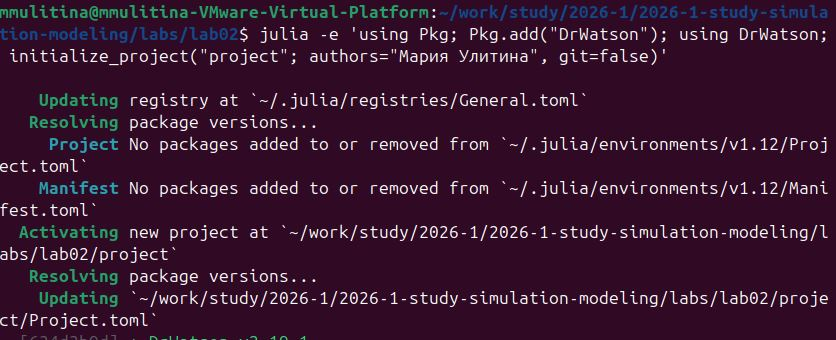
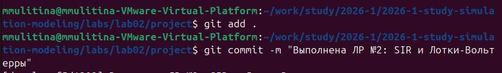

---
## Author
author:
  name: Улитина Мария Максимовна
  email: 1132236002@rudn.ru
  affiliation:
    - name: Российский университет дружбы народов
      country: Российская Федерация
      postal-code: 117198
      city: Москва
      address: ул. Миклухо-Маклая, д. 6

## Title
title: "Отчёт по лабораторной работе №2"
subtitle: "Имитационное моделирование"
license: "CC BY"
---

# Цель работы

Цель данной лабораторной работы — подготовить рабочее пространство для выполнения программ и приобрести необходимые навыки создания и преобразования программ на Julia.

# Задание

- Создать рабочий каталог для всего курса.
- Создать рабочее пространство для программ в рамках лабораторной работы.
- Выполнить все задания по тексту лабораторной работы.
- Установить необходимые пакеты.
- Выполнить предложенный код.
- Преобразовать код в литературный стиль.
- Сгенерировать из литературного кода:
	- чистый код;
	- jupyter notebook;
	- документацию в формате Quarto.
	- Выполнить код из jupyter notebook.
- Интегрировать документацию в формате Quarto в отчёт.
- Добавить в код в литературном стиле вычисление для набора параметров.
- Сгенерировать из литературного кода с параметрами:
	- чистый код;
	- jupyter notebook;
	- документацию в формате Quarto.
	- Выполнить код из jupyter notebook с параметрами.
- Интегрировать документацию с параметрами в формате Quarto в отчёт.

# Выполнение лабораторной работы

## Создание рабочего каталога курса

Создаём репозиторий на основе шаблона ([рис. @fig-001]).

{#fig-001 width=70%}

Инициализируем проект ([рис. @fig-002]).

{#fig-002 width=70%}

Загрузим необходимые пакеты ([рис. @fig-003]).

{#fig-003 width=70%}

Создадим необходимые скрипты ([рис. @fig-004]).

{#fig-004 width=70%}

Отправим изменения в git ([рис. @fig-005]).

{#fig-005 width=70%}





# Выводы

В ходе выполнения лабораторной работы была реализована Модель SIR -  модель эпидемиологии, описывающая распространение инфекционного заболевания в закрытой популяции.

# Источники

[1] W. O. Kermack and A. G. McKendrick, "A Contribution to the Mathematical Theory of Epidemics," *Proceedings of the Royal Society of London. Series A, Containing Papers of a Mathematical and Physical Character*, vol. 115, no. 772, pp. 700–721, 1927.

[2] H. W. Hethcote, "The Mathematics of Infectious Diseases," *SIAM Review*, vol. 42, no. 4, pp. 599–653, 2000.

[3] A. J. Lotka, *Elements of Physical Biology*. Baltimore: Williams & Wilkins Company, 1925.

[4] A. J. Lotka, "Contribution to the Theory of Periodic Reaction," *The Journal of Physical Chemistry A*, vol. 14, no. 3, pp. 271–274, 1910.

[5] V. Volterra, "Variations and fluctuations of the number of individuals in animal species living together," *Journal du Conseil permanent International pour l’ Exploration de la Mer*, vol. 3, no. 1, pp. 3–51, 1928.

[6] B. Вольтерра, *Математическая теория борьбы за существование*. Москва: Наука, 1976.